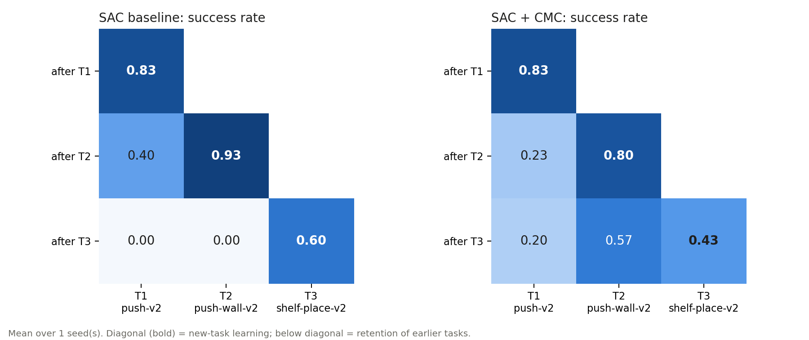
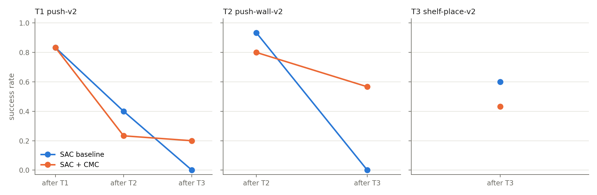
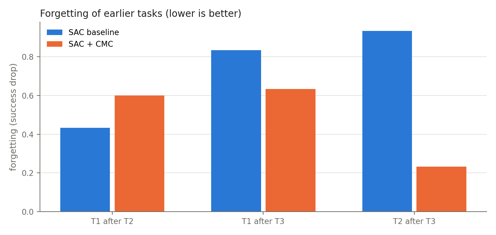
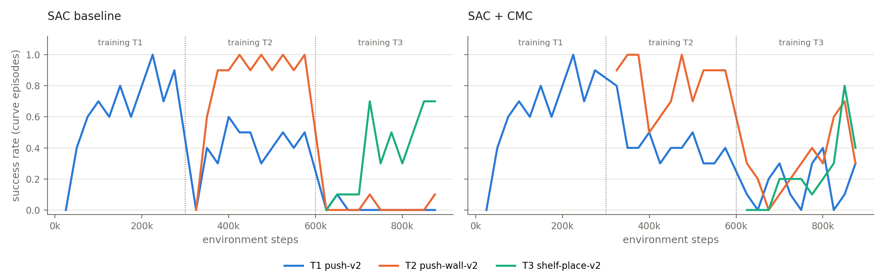

# Continual learning: SAC baseline vs SAC + CMC

Tasks: T1 push-v2 → T2 push-wall-v2 → T3 shelf-place-v2  
Paired seeds: [1] (values are mean ± std over seeds)

Evaluation protocol identical in both arms (same tasks, budget, episode count and evaluation episodes).

## ⚠ Tasks not reliably learned

A task that was never reliably learned cannot meaningfully be forgotten; read its numbers with care.

- SAC baseline: T3 reached only 0.60 success right after training (< 0.8).
- SAC + CMC: T3 reached only 0.43 success right after training (< 0.8).

## Success rate (primary)

### SAC baseline

| after stage | T1 push-v2 | T2 push-wall-v2 | T3 shelf-place-v2 |
|---|---|---|---|
| after T1 | **0.83** | – | – |
| after T2 | 0.40 | **0.93** | – |
| after T3 | 0.00 | 0.00 | **0.60** |

### SAC + CMC

| after stage | T1 push-v2 | T2 push-wall-v2 | T3 shelf-place-v2 |
|---|---|---|---|
| after T1 | **0.83** | – | – |
| after T2 | 0.23 | **0.80** | – |
| after T3 | 0.20 | 0.57 | **0.43** |

### Continual-learning metrics (success)

| group | metric | SAC baseline | SAC + CMC | CMC − baseline |
|---|---|---|---|---|
| New-task learning | T1 after T1 | 0.83 | 0.83 | 0.00 |
| New-task learning | T2 after T2 | 0.93 | 0.80 | -0.13 |
| New-task learning | T3 after T3 | 0.60 | 0.43 | -0.17 |
| Retained value | T1 after T2 | 0.40 | 0.23 | -0.17 |
| Retained value | T1 after T3 | 0.00 | 0.20 | 0.20 |
| Retained value | T2 after T3 | 0.00 | 0.57 | 0.57 |
| Forgetting | T1: after T1 − after T2 | 0.43 | 0.60 | 0.17 |
| Forgetting | T1: after T1 − after T3 | 0.83 | 0.63 | -0.20 |
| Forgetting | T2: after T2 − after T3 | 0.93 | 0.23 | -0.70 |
| Summary | Average final (all tasks after T3) | 0.20 | 0.40 | 0.20 |
| Summary | Average forgetting (T1, T2 after T3) | 0.88 | 0.43 | -0.45 |

Forgetting > 0 means success dropped after later training; CMC − baseline < 0 for forgetting means CMC forgot less.

## Return (secondary)

### SAC baseline

| after stage | T1 push-v2 | T2 push-wall-v2 | T3 shelf-place-v2 |
|---|---|---|---|
| after T1 | **3289** | – | – |
| after T2 | 1603 | **4022** | – |
| after T3 | 53 | 65 | **2026** |

### SAC + CMC

| after stage | T1 push-v2 | T2 push-wall-v2 | T3 shelf-place-v2 |
|---|---|---|---|
| after T1 | **3289** | – | – |
| after T2 | 1007 | **3235** | – |
| after T3 | 448 | 2425 | **1252** |

### Continual-learning metrics (return)

| group | metric | SAC baseline | SAC + CMC | CMC − baseline |
|---|---|---|---|---|
| New-task learning | T1 after T1 | 3289 | 3289 | 0 |
| New-task learning | T2 after T2 | 4022 | 3235 | -787 |
| New-task learning | T3 after T3 | 2026 | 1252 | -773 |
| Retained value | T1 after T2 | 1603 | 1007 | -596 |
| Retained value | T1 after T3 | 53 | 448 | 395 |
| Retained value | T2 after T3 | 65 | 2425 | 2360 |
| Forgetting | T1: after T1 − after T2 | 1686 | 2282 | 596 |
| Forgetting | T1: after T1 − after T3 | 3236 | 2841 | -395 |
| Forgetting | T2: after T2 − after T3 | 3958 | 811 | -3147 |
| Summary | Average final (all tasks after T3) | 714 | 1375 | 661 |
| Summary | Average forgetting (T1, T2 after T3) | 3597 | 1826 | -1771 |

## Figures

_Only 1 seed(s): differences between arms are not statistically supported. Run at least 3 seeds per arm before drawing conclusions._
